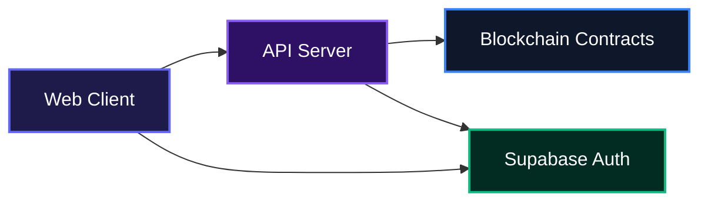
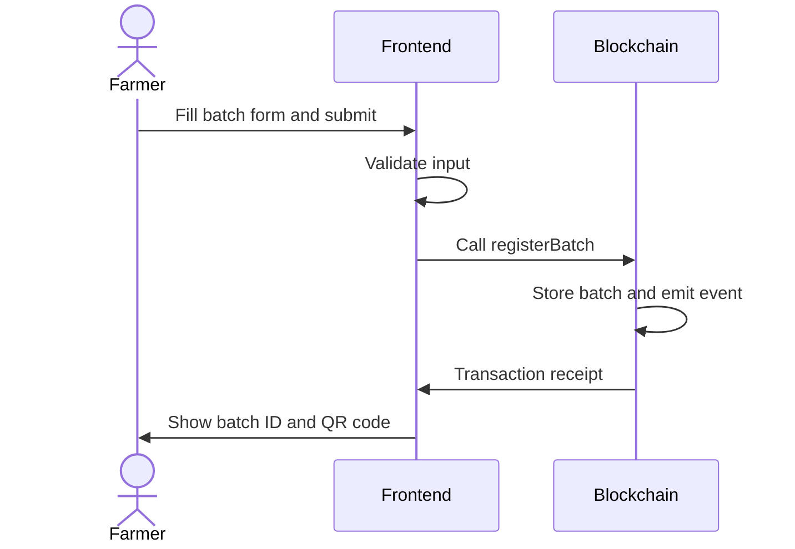
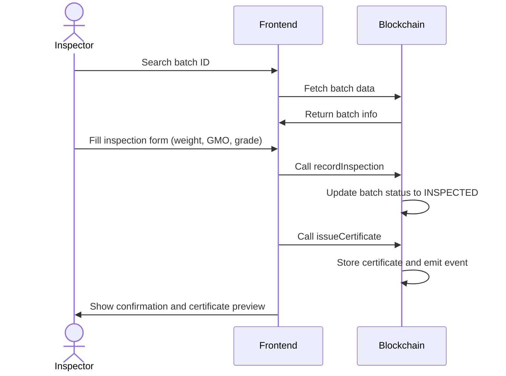
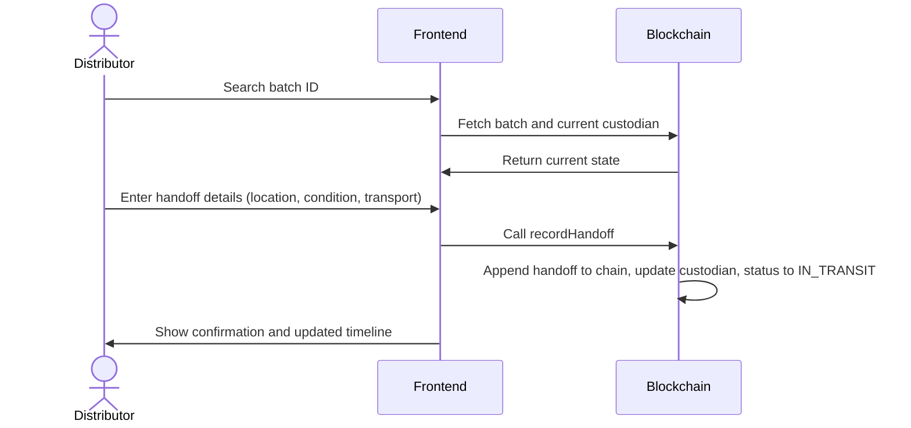

# AgriTrust

Transparent agricultural supply chain verification anchored on blockchain. From farm registration to consumer QR scan, every handoff is signed, timestamped, and permanently stored, giving growers, inspectors, distributors, and regulators one trusted source of truth for safe, traceable produce.

## Overview

Food supply chains often hide where produce comes from, how it was handled, and whether it meets safety standards. AgriTrust changes that. It gives every batch of produce a public, immutable passport. Farmers register their crops, certified inspectors record biosafety checks, logistics operators log custody handoffs, and regulators monitor compliance across the network, all without paperwork. Consumers scan a QR code on the product to see the full verified journey, no app or crypto wallet needed. AgriTrust is built for the realities of Nigerian agriculture, working on the devices farmers actually use.

## System Architecture



## Features

- **Immutable batch passports** – Every registered batch gets an on-chain ID and a QR code that points to its complete history.
- **NAFDAC-ready inspections** – Inspectors record biosafety checks, GMO status, and quality grades. A signed certificate is issued on-chain.
- **Custody handoff recording** – Distributors log each transfer of custody, capturing location, condition, and transport method.
- **Role-based dashboards** – Different views for farmers, inspectors, distributors, and regulators, each showing the data that matters to them.
- **Public consumer verification** – Anyone can scan a QR code to see the full produce passport, no login required.
- **Compliance analytics** – Regulators see network-wide compliance rates, flagged batches, and inspector performance.
- **Audit trail** – Every transaction is permanently stored and visible in a chronological ledger.
- **Web3 wallet integration** – Connect with MetaMask or WalletConnect to sign transactions and interact with the smart contracts.

### Batch Registration Flow

When a farmer registers a new batch, the data is written to the ProduceRegistry smart contract and becomes instantly traceable.



### Inspection and Certification

An approved inspector loads a registered batch, records inspection details, and issues a biosafety certificate. The certificate is anchored on-chain and immediately visible to regulators and consumers.



### Handoff Recording

A distributor records the transfer of a certified batch to the next actor in the supply chain. Each handoff is timestamped and becomes part of the immutable journey.



## Installation

### Prerequisites

- Node.js 18 or later
- npm or yarn
- A Supabase project (for authentication and user data)
- Metamask or WalletConnect-compatible wallet to interact with smart contracts

### Frontend Setup

1. Clone the repository:

```bash
git clone https://github.com/jamzy-codes/agritrust.git
cd agritrust
```

2. Install dependencies:

```bash
npm install
```

3. Set up environment variables:

Create a `.env.local` file in the project root. You'll need the following:

```
NEXT_PUBLIC_SUPABASE_URL=https://your-project.supabase.co
NEXT_PUBLIC_SUPABASE_ANON_KEY=your-anon-key
SUPABASE_SERVICE_ROLE_KEY=your-service-role-key
```

The `SUPABASE_SERVICE_ROLE_KEY` is used by the server-side signup endpoint to create users without email confirmation.

4. Run the development server:

```bash
npm run dev
```

Open [http://localhost:3000](http://localhost:3000) to see the app.

### Blockchain Setup (Smart Contracts)

The blockchain contracts are in the `blockchain/` directory.

1. Navigate to the blockchain folder:

```bash
cd blockchain
npm install
```

2. Set up environment variables for the blockchain:

Create a `.env` file inside `blockchain/` with:

```
PRIVATE_KEY=your_wallet_private_key
AMOY_RPC_URL=https://rpc-amoy.polygon.technology
POLYGONSCAN_API_KEY=your_polygonscan_api_key
```

3. Compile the contracts:

```bash
npm run compile
```

4. To deploy locally using Hardhat network:

```bash
npm run deploy:local
```

5. To deploy on Polygon Amoy testnet, run:

```bash
npx hardhat ignition deploy ./ignition/modules/AgriTrustModule.ts --network amoy --parameters ./ignition/parameters.json
```

Make sure to update `ignition/parameters.json` with your regulator wallet address.

## Usage

After starting the frontend, open your browser at `http://localhost:3000`. You'll see the landing page that explains the platform and offers links to register and verify produce.

### Creating an Account

1. Click "Get Started" or "Create Account".
2. Fill in your name, email, phone, and password.
3. Optionally connect a Web3 wallet.
4. After account creation, you'll be taken to the onboarding page to choose your role: Farmer, Inspector, Distributor, or Regulator.
5. Once you select a role, the dashboard loads with relevant features.

### Working as a Farmer

- **Dashboard** shows your active batches, upcoming actions, and recent certifications.
- **Register** lets you create new batches with crop type, quantity, seed variety, and GMO declaration.
- **Trace** provides a timeline view of each batch's journey.

### Working as an Inspector

- **Register** opens a verification tab where you can search a batch, enter inspection details, and issue a biosafety certificate.
- **Compliance** lets you view and manage certificates.

### Working as a Distributor

- **Register** provides a handoff tab to log custody transfers between supply chain actors.

### Working as a Regulator

- **Analytics** shows network stats, compliance by crop, non-compliance by region, and inspector output.
- **Alerts** displays critical and warning flags.
- **Audit Trail** lists every blockchain transaction in order.

### Public Verification

Any consumer can scan a QR code (or navigate to `/verify/[batchId]`) to see the produce passport, inspect the supply chain journey, and confirm the batch's biosafety status, without logging in.

## Technologies Used

| Technology | Description | Link |
|------------|-------------|------|
| Next.js | React framework for frontend and API routes | https://nextjs.org |
| TypeScript | Type-safe JavaScript | https://www.typescriptlang.org |
| React | UI library | https://react.dev |
| Tailwind CSS | Utility-first CSS framework | https://tailwindcss.com |
| Solidity | Smart contract language | https://soliditylang.org |
| Hardhat | Ethereum development environment | https://hardhat.org |
| Supabase | Auth, database, and realtime APIs | https://supabase.com |
| Wagmi | React hooks for Ethereum | https://wagmi.sh |
| RainbowKit | Wallet connection flow | https://rainbowkit.com |
| Viem | TypeScript Ethereum interface | https://viem.sh |
| ethers.js | Ethereum library | https://ethers.org |
| Recharts | Charting library | https://recharts.org |
| Framer Motion | Animations | https://www.framer.com/motion |
| Lucide React | Icon library | https://lucide.dev |

## API Documentation

### POST /api/auth/signup

Creates a new user account with immediate confirmation (no email verification required). This endpoint is called by the registration form.

**Request**:

```json
{
  "email": "farmer@example.com",
  "password": "securePassword123",
  "fullName": "Amara Okafor",
  "phone": "08012345678"
}
```

**Response** (200):

```json
{
  "user": {
    "id": "uuid-string",
    "email": "farmer@example.com",
    ...
  }
}
```

**Errors**:

- 400 – Missing email or password
- 400 – Supabase error (e.g., email already registered)
- 500 – Unexpected server error

### Environment Variables

| Variable | Description |
|----------|-------------|
| `NEXT_PUBLIC_SUPABASE_URL` | URL of your Supabase project |
| `NEXT_PUBLIC_SUPABASE_ANON_KEY` | Supabase anonymous key for client-side queries |
| `SUPABASE_SERVICE_ROLE_KEY` | Supabase service role key for admin operations |
| `PRIVATE_KEY` | Wallet private key for contract deployment (blockchain) |
| `AMOY_RPC_URL` | RPC URL for Polygon Amoy testnet (blockchain) |
| `POLYGONSCAN_API_KEY` | Polygonscan API key for contract verification |

## Author Info

- X: [https://x.com/Only_1_Jamzy](https://x.com/Only_1_Jamzy)

## Badges

[](https://www.typescriptlang.org/)
[](https://nextjs.org/)
[](https://react.dev/)
[](https://tailwindcss.com/)
[](https://soliditylang.org/)
[](https://hardhat.org/)
[](https://supabase.com/)
[](https://wagmi.sh/)

[](https://dokugen.samueltuoyo.com)